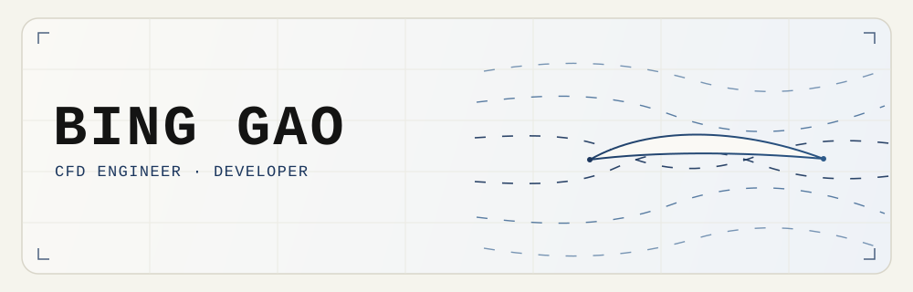

  

  <code>Paris</code> · <code>CFD Engineer &amp; Developer</code> · <code>Open to CFD / Aerodynamic work</code>

---

## About Me

Hi ! 👋 I'm Bing Gao, a Master’s student in Modelling & Computational Mechanics at École supérieure d’ingénieurs Léonard de Vinci ([ESILV](https://www.esilv.fr/en/programmes/master-degree-engineering/majors/digital-modeling-mechanics/)), while also as an aerodynamics team member for our school's Formula Student racing team, Vinci Eco Drive. My responsibilities within the team primarily cover aerodynamic and aero kit design, cooling system design, thermal-fluid modeling, numerical validation, and the development of custom simulation tools.

Prior to transitioning into engineering, I accumulated nearly 8 years of experience in mobile software development and team management. As a core developer of Lao You (which means "Old Friend" in Chinese, [iOS](https://apps.apple.com/us/app/%E8%80%81%E6%9F%9A/id1157853494) / [Android](https://sj.qq.com/appdetail/com.laoyouzhibo.app)), a live-streaming application in China, I built the product from scratch, contributed over 70% of its core code, and helped scale it from zero to over 2M users. Through this experience, I developed deep domain expertise across audio/video codecs, complex live-room architecture design, complex business logic, cross-platform integration(React Native / Flutter), hot-fixing, app security, code obfuscation, and CI/CD automation, etc.

Additionally, from 2015 to 2023, I served as a core organizer for Google Developer Group Beijing (GDG Beijing). I organized around 5+ technical events annually, with attendance ranging from 200 to 1000 participants per event. I invited developers and tech experts from Google Teams and top-tier tech companies in Beijing as speakers, while actively driving tech sharing and community outreach across mobile development, front-end engineering, Google Cloud, TensorFlow, and emerging AI technologies.

Finally, I am an open-source contributor on GitHub, focusing on scientific computing, numerical solvers, serialization, and data processing tools. Every library I contribute to is one I actively use in my projects, and every Pull Request stems from a real-world problem I encountered. Leveraging modern tools like Codex and Claude Code, I can identify and resolve issues more efficiently. Furthermore, I maintain a strict regression testing workflow to guarantee the stability and quality of all my merged PRs.

---

## Engineering Portfolio

- [Bing Gao — CFD Engineer & Developer](https://binggao.dev/)
- [OpenFOAM in Practice: F1 2026 Aero Window](https://binggao.dev/projects/f1-2026-aero/)
- [FSAE Cooling System Design and Validation](https://binggao.dev/projects/fsae-cooling/)
- [FlowLab: Lattice Boltzmann Solver](https://binggao.dev/projects/flowlab/)

---

### `01` · OPEN SOURCE CONTRIBUTIONS

More than **600 merged pull requests**. The eight tested fixes below were selected collectively for technical depth, substantive maintainer discussion, project reach, and, where applicable, relevance to scientific computing and CFD.

| Project | What changed | Pull request |
| --- | --- | --- |
| [`SU2`](https://github.com/su2code/SU2)  | Fixed Nastran small-field real parsing in the modal structural solver | [`su2code/SU2#2859`](https://github.com/su2code/SU2/pull/2859) |
| [`pandas`](https://github.com/pandas-dev/pandas)  | Warned on deprecated epoch formatting for datetime-typed indexes and columns in `to_json` | [`pandas-dev/pandas#65869`](https://github.com/pandas-dev/pandas/pull/65869) |
| [`PhpSpreadsheet`](https://github.com/PHPOffice/PhpSpreadsheet)  | Fixed incomplete-gamma convergence in `GAMMA.DIST` and `CHISQ.DIST` | [`PHPOffice/PhpSpreadsheet#4945`](https://github.com/PHPOffice/PhpSpreadsheet/pull/4945) |
| [`pypdf`](https://github.com/py-pdf/pypdf)  | Recovered PDFs with a corrupt trailing `startxref` pointer | [`py-pdf/pypdf#3826`](https://github.com/py-pdf/pypdf/pull/3826) |
| [`Pylint`](https://github.com/pylint-dev/pylint)  | Prevented sync and async context-manager checks from crashing on unnamed inferred nodes | [`pylint-dev/pylint#11103`](https://github.com/pylint-dev/pylint/pull/11103) |
| [`PyVista`](https://github.com/pyvista/pyvista)  | Preserved coordinate dtype when converting `RectilinearGrid` and `ImageData` to `UnstructuredGrid` | [`pyvista/pyvista#8723`](https://github.com/pyvista/pyvista/pull/8723) |
| [`TorchIO`](https://github.com/TorchIO-project/torchio)  | Preserved image scope when applying inverse transforms | [`TorchIO-project/torchio#1481`](https://github.com/TorchIO-project/torchio/pull/1481) |
| [`python-control`](https://github.com/python-control/python-control)  | Prevented matched `c2d`/`sample` from returning NaN for poles or zeros at the origin | [`python-control/python-control#1241`](https://github.com/python-control/python-control/pull/1241) |

---

### `02` · STACK

<h4 align="left">MECHANICAL · SIMULATION · CAD / 3D</h4>

  
  &nbsp;
  
  
  
  
  
  
  
  &nbsp;
  

<h4 align="left">SOFTWARE DEVELOPMENT</h4>

<table width="100%">
  <thead>
    <tr>
      <th width="33%">FRONTEND</th>
      <th width="34%">BACKEND</th>
      <th width="33%">MOBILE</th>
    </tr>
  </thead>
  <tbody>
    <tr>
      <td align="center" valign="top">
        
        
        
        
        
      </td>
      <td align="center" valign="top">
        
        
        
        
        
        
        
        
      </td>
      <td align="center" valign="top">
        
        
        
        
        
        
      </td>
    </tr>
  </tbody>
</table>

---

### `03` · CONNECT

  
  &nbsp;
  
  &nbsp;
  

